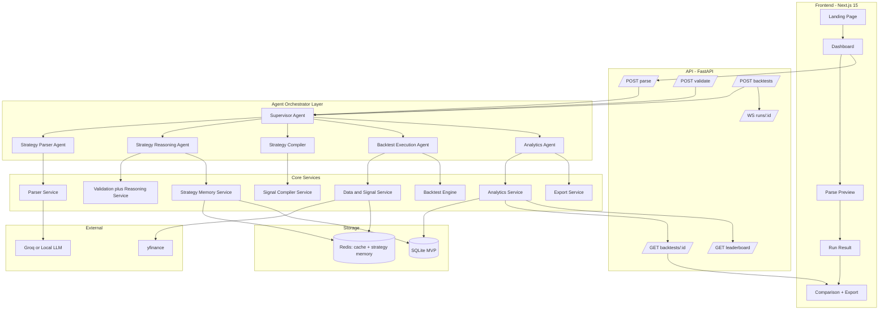

# Astra AI - Best Implementation Plan

> Goal: Build a fast, trustworthy AI backtesting product where a user writes a trading strategy in natural language, the system converts it into validated structured rules, runs a realistic historical simulation, and returns a clean tearsheet with equity curve, Sharpe ratio, max drawdown, win rate, and trade diagnostics within seconds.

---

## Executive Summary

This implementation plan is optimized for what actually matters:

1. Reliable natural-language-to-strategy parsing.
2. Explainable strategy reasoning before execution.
3. Deterministic backtest execution.
4. Realistic friction modeling.
5. Fast feedback loops for iteration.
6. Clear separation between MVP and production hardening.

This version keeps the Agentic AI theme, but uses a bounded six-agent core model with one optional improvement agent instead of uncontrolled autonomous chains. The system should feel agentic to the user while staying deterministic and testable under the hood. The Parser Agent is the only LLM agent. The Supervisor, Strategy Reasoning, Strategy Compiler, Backtest Execution, and Analytics Agents are deterministic or rule-driven agents with fixed contracts. An optional Strategy Improvement Agent enables conversational iteration after results return.

Recommended architecture:

1. Next.js 15 frontend for chat input, run history, and tearsheets.
2. FastAPI backend for orchestration, validation, backtesting, analytics, memory, and persistence.
3. One pluggable parser provider for Groq or local models.
4. A bounded multi-agent orchestration layer centered on Supervisor, Parser, Strategy Reasoning, Strategy Compiler, Backtest Execution, and Analytics.
5. Deterministic Python services for validation, data loading, indicators, simulation, metrics, and reporting.
6. SQLite for durable run storage plus Redis for cache and short-lived strategy memory.
7. Yahoo Finance for MVP data, wrapped behind an adapter and cache.

---

## Product Scope

### Primary User Story

A trader types:

"Buy when the 50-day moving average crosses above the 200-day moving average. Sell when RSI 14 exceeds 70. Use TCS.NS over 2 years."

The system should:

1. Parse the strategy into structured rules.
2. Show the parsed interpretation back to the user.
3. Validate that the strategy is supported and unambiguous.
4. Run a deterministic backtest with commission and slippage.
5. Return a tearsheet with metrics, signals, and trade summaries.
6. Let the user refine the strategy conversationally and compare runs.

### In Scope

1. Natural language strategy input.
2. Equities and crypto support.
3. India-first symbol and benchmark support.
4. Commission and slippage modeling.
5. Equity curve, drawdown, Sharpe, win rate, total return, trade table.
6. Comparison between strategy and benchmark.
7. Export as JSON, CSV, and PDF.

### Out of Scope for MVP

1. Live trading execution.
2. Broker integrations.
3. Multi-user collaboration.
4. Real-time tick backtesting.
5. Full portfolio optimization.
6. Open-ended autonomous agent behavior without hard execution boundaries.

---

## Architecture Principles

1. Agentic architecture, bounded by contracts.
Agents are allowed, but each agent must have a fixed responsibility, typed inputs, typed outputs, and clear fallback behavior.

2. One LLM reasoning step only.
The LLM is used for translation from natural language to schema. It does not decide risk, performance, certification, or allocation.

3. Deterministic execution only after validation.
No raw LLM output is executed directly.

4. UI storytelling must not distort system truth.
The factory pipeline shown in the UI should map to real agent stages, not fake reasoning authority.

5. MVP and production need separate expectations.
MVP uses practical tools that ship fast. Production adds stronger data, caching, observability, and deployment discipline.

6. Build the execution contract before the design system.
The correctness of fills, fees, benchmarks, and warmup handling matters more than visual polish.

---

## Recommended System Architecture



---

## Why This Architecture Wins

### What Changes From The Earlier Plan

Replace this:

1. Multi-hop agent chains passing free-form state to each other.
2. Certification and optimization in the hot path.
3. LLM-heavy orchestration for deterministic work.

With this:

1. A Supervisor Agent coordinating five specialist agents with typed handoffs.
2. One LLM-powered Strategy Parser Agent using strict JSON output validation.
3. A Strategy Reasoning Agent that explains feasibility, contradictions, and risk notes before execution.
4. A Strategy Compiler that converts validated schemas into executable signal vectors.
5. A deterministic Backtest Execution Agent that owns data loading, simulation, fees, and slippage.
6. An Analytics Agent that transforms raw results into metrics, insights, and export payloads.
7. Explicit run lifecycle and WebSocket progress events.
8. UI pipeline stages that map to real agent and service boundaries.

### Benefits

1. Lower latency.
2. Lower API cost.
3. Easier debugging.
4. Easier testing.
5. More trustworthy results.
6. Faster path to MVP.

---

## Agentic Layer Design

The product should explicitly present itself as an Agentic AI system, but the agents must be bounded and visibly collaborative.

### Agent Model

Each agent has:

1. A fixed role.
2. A typed input contract.
3. A typed output contract.
4. A timeout and retry policy.
5. No permission to invent new execution behavior outside its scope.

### Recommended Agents

#### 1. Supervisor Agent

Responsibilities:

1. Receive the user request.
2. Coordinate the full run lifecycle.
3. Call the other agents in order.
4. Track status, runtime, and summaries across agents.
5. Stop execution on hard validation or data failures.
6. Return the final result and top-level explanation.

Type:

1. Deterministic orchestrator.

Why it matters:

1. Without it the system reads like a simple pipeline.
2. With it the product demonstrates real agent coordination.

#### 2. Strategy Parser Agent

Responsibilities:

1. Convert natural language into structured trading DSL or JSON.
2. Return confidence and ambiguity notes.
3. Explain the parsed strategy in human language.
4. Enforce indicator and operator enums through the schema.
5. Emit no executable code.

Type:

1. LLM-powered agent.

Important constraints:

1. Strict schema only.
2. Enumerated indicators and operators only.
3. No executable Python or strategy code generation.
4. This is the only LLM agent in MVP.

Example output:

```json
{
  "entry": [
    {
      "indicator": "SMA",
      "period": 50,
      "condition": "crosses_above",
      "target_indicator": "SMA",
      "target_period": 200
    }
  ],
  "exit": [
    {
      "indicator": "RSI",
      "period": 14,
      "condition": ">",
      "value": 70
    }
  ]
}
```

#### 3. Strategy Reasoning Agent

Responsibilities:

1. Check schema correctness.
2. Detect contradictions and invalid defaults.
3. Check feasibility against supported engine behavior.
4. Estimate risk qualitatively using deterministic heuristics.
5. Generate warnings, data requirements, and reasoning notes.
6. Normalize the strategy into executable form.
7. Produce a human-readable strategy explanation with type classification.

Type:

1. Deterministic reasoning and rule-checking agent.

Why it matters:

1. This is what makes the system feel agentic instead of blindly mechanical.
2. It gives users explainable AI before capital assumptions are applied.
3. Judges can see reasoning output without giving the model control over execution.

Example output:

```text
Analysis:

Strategy Type: Trend Following

Explanation:
The strategy buys when the short-term trend (SMA 50) becomes stronger than the long-term trend (SMA 200) and exits when the asset becomes overbought according to RSI. This is a classic trend-following approach that performs well in sustained directional markets but may underperform during sideways or choppy conditions.

Risk Notes:
- RSI exit may cause early exits during strong trends
- Strategy depends on long-term trend regime
- No stop-loss protection against sudden drawdowns

Data Requirements:
- Minimum 200 bars required for SMA 200 warmup
- Additional 20% buffer recommended (240 bars minimum)

Confidence: 0.84
```

#### 4. Strategy Compiler

The Strategy Compiler sits between the Strategy Reasoning Agent and the Backtest Execution Agent. It converts the validated strategy schema into executable signal vectors that the engine can consume directly.

Responsibilities:

1. Convert entry and exit rules into indicator computation instructions.
2. Generate boolean entry and exit signal vectors from rules.
3. Handle indicator-to-computation mapping for all supported indicators.
4. Ensure signal alignment with execution timing rules.
5. Validate that all required indicator data is computable from the available bar schema.
6. Return pre-computed signal arrays ready for the simulation loop.

Type:

1. Deterministic compilation agent.

Why it matters:

1. It separates the concern of what a strategy means from how it executes.
2. The Backtest Execution Agent receives clean signal vectors instead of parsing rules during simulation.
3. Signal compilation can be tested independently from the simulation loop.
4. It makes the pipeline more modular and easier to debug.
5. The Strategy Compiler ensures that the simulation engine never interprets strategy rules directly, improving determinism and testability.

Example output:

```python
# Compiled signals from "Golden Cross with RSI Exit"
entry_signal = crossover(sma(close, 50), sma(close, 200))
exit_signal = rsi(close, 14) > 70

# Boolean vectors aligned to bar timestamps
entry_vector = [False, False, ..., True, False, ..., False]
exit_vector  = [False, False, ..., False, True, ..., False]
```

Input:

1. Validated strategy schema from the Strategy Reasoning Agent.
2. Market data OHLCV DataFrame provided by the Execution Agent.

Output:

1. Computed indicator series (SMA, EMA, RSI, MACD, etc.).
2. Boolean entry signal vector.
3. Boolean exit signal vector.
4. Warmup offset indicating where valid signals begin.
5. Compilation metadata for debugging.

Backend module:

1. `backtesting/compiler.py`

#### 5. Backtest Execution Agent

Responsibilities:

1. Fetch market data for symbols and benchmark.
2. Pass market data to the Strategy Compiler for signal generation.
3. Receive compiled entry and exit signal vectors from the Strategy Compiler.
4. Apply indicator warmup window to exclude early invalid signals.
5. Run the vectorbt or wrapped engine simulation using the compiled signals.
6. Apply slippage and commission.
7. Track positions, trades, and portfolio equity.
8. Enforce lookahead bias protection on every trade execution.
9. Return the trade ledger, returns, and equity curve.

Type:

1. Deterministic execution agent.

Outputs:

1. Equity curve.
2. Trade ledger.
3. Portfolio returns.
4. Signal timestamps for visualization.

#### 6. Analytics Agent

Responsibilities:

1. Compute tearsheet metrics.
2. Generate benchmark comparisons.
3. Produce factual insights and warnings.
4. Prepare frontend summaries and export payloads.
5. Surface trade statistics and run diagnostics.
6. Generate risk warning flags based on deterministic rules.

Type:

1. Deterministic analytics agent.

Computes:

1. Sharpe ratio.
2. Sortino ratio.
3. Max drawdown.
4. Win rate.
5. Total return.
6. Benchmark comparison.
7. Trade statistics.

Risk Warning System:

The Analytics Agent generates risk flags based on deterministic metric thresholds. These are informational warnings, not financial advice. They help users understand the limitations of their strategy.

1. ⚠ Low trade count: fewer than 5 completed trades. Results may not be statistically significant.
2. ⚠ High drawdown: max drawdown exceeding 25%. Consider adding stop-loss or exit rules.
3. ⚠ Regime sensitivity: strategy type classified as trend-following but tested during a period with no sustained trend.
4. ⚠ High turnover: more than 50 round-trip trades per year. Commission drag may be significant.
5. ⚠ Low win rate: win rate below 35%. Strategy depends on outsized winners.
6. ⚠ Short test period: backtest covers fewer than 252 trading days. Results may not generalize.
7. ⚠ Concentration risk: single-symbol backtest. Diversification effects are not captured.

Example risk output:

```text
Risk Warnings:

⚠ Low trade count: 4 trades in 2 years — results may not be statistically significant
⚠ High drawdown: max drawdown of 28.3% — consider adding stop-loss rules
⚠ Strategy sensitive to trending regimes — performance may differ in sideways markets

Note: These warnings are informational only. They do not constitute financial advice.
```

Example insight output:

```text
Insights:

- Strategy outperformed NIFTY50 by 6.2%
- Largest drawdown occurred during the 2022 correction
- Average trade duration: 14 days
```

#### 7. Strategy Improvement Agent (Optional)

The Strategy Improvement Agent runs after the Analytics Agent completes. It is an optional extension that suggests improved strategy variants based on the completed backtest results.

Responsibilities:

1. Analyze completed run metrics to identify potential improvements.
2. Suggest parameter variations based on deterministic heuristics.
3. Propose structural changes such as indicator swaps or additional exit rules.
4. Present suggestions to the user for approval before any variant is executed.
5. Support conversational iteration by interpreting follow-up instructions like "reduce drawdown" or "increase trade frequency".

Type:

1. Deterministic suggestion agent. Uses rule-based heuristics, not LLM, to generate variants.

Why it matters:

1. It turns the tool from a one-shot backtester into an iterative research assistant.
2. It demonstrates visible agent collaboration across reasoning, execution, and analytics.
3. Users can refine strategies conversationally without rewriting their input from scratch.
4. Judges see a clear example of agent-guided iteration within bounded safety constraints.

Example suggestions:

```text
Improvement Suggestions:

1. Replace SMA with EMA for faster trend response
   Variant: EMA 50 / EMA 200 crossover
   Rationale: EMA reacts faster to recent price changes

2. Adjust RSI exit threshold
   Variant A: RSI exit at 65 (earlier exit, lower drawdown risk)
   Variant B: RSI exit at 75 (later exit, higher return potential)

3. Add stop-loss protection
   Variant: Add 5% trailing stop-loss
   Rationale: Current strategy has no downside protection
```

Conversational iteration support:

When a user sends a follow-up like "reduce drawdown" after seeing results, the Supervisor routes it to the Strategy Improvement Agent. The agent interprets the intent deterministically:

1. "reduce drawdown" → lower RSI exit threshold, add stop-loss rule.
2. "increase trade frequency" → reduce crossover periods.
3. "use EMA instead" → swap SMA indicators for EMA with same periods.

The Supervisor can then launch variant backtests with user approval and present a comparison table.

Backend module:

1. `agents/improvement_agent.py`

Safety constraints:

1. The Improvement Agent may never modify or execute a strategy without explicit user approval.
2. All suggestions are presented as options, not automatic actions.
3. Variant backtests run through the same full pipeline as the original.

### Agent Handoff Rules

1. Agents communicate only through typed models.
2. The Supervisor Agent owns final success and failure states.
3. Only the Parser Agent may call an LLM in MVP.
4. The Strategy Reasoning Agent may annotate risk and feasibility, but may not override the schema or engine.
5. The Backtest Execution Agent owns every data, signal, and portfolio calculation.
6. Agent logs must be persisted for UI replay and debugging.

### Final Agent Interaction

```text
Supervisor
   |
   |-- Parser Agent
   |
   |-- Strategy Reasoning Agent
   |
   |-- Strategy Compiler
   |
   |-- Backtest Execution Agent
   |
   |-- Analytics Agent
   |
   '-- Strategy Improvement Agent (optional)
```

## Agent Memory

Add a strategy memory store to make iteration feel cumulative without turning the system into an uncontrolled autonomous loop.

What agents remember:

1. Previously tested strategy structures.
2. Performance summaries for similar strategies.
3. Common failure patterns such as too-few trades or excessive drawdown.
4. Useful variant patterns such as EMA replacing SMA in similar crossover strategies.

Recommended design:

1. Redis stores short-lived memory summaries and fast lookup keys.
2. SQLite stores durable memory records tied to completed runs.
3. Memory is advisory only and never mutates an active run without user approval.

Example memory insight:

```text
Similar strategies tested previously
Average Sharpe: 1.21
Best performing variant used EMA instead of SMA
```

### Strategy Fingerprinting

Strategy fingerprinting enables the memory system to detect similar strategies across runs and generate comparative insights without requiring exact matches.

Purpose:

1. Identify structurally similar strategies even when parameters differ.
2. Enable memory lookups for relevant past performance data.
3. Support the Strategy Improvement Agent with variant history.
4. Avoid redundant backtests for near-identical strategies.

Fingerprint generation:

A strategy fingerprint is a normalized string hash derived from the structural components of the strategy, ignoring specific parameter values.

Fingerprint components:

1. Entry indicator types in sorted order.
2. Entry operator types.
3. Exit indicator types in sorted order.
4. Exit operator types.
5. Asset class.

Example fingerprint derivation:

```text
Strategy: "Buy when SMA 50 crosses above SMA 200. Sell when RSI > 70."

Structural key: sma_crossover + rsi_exit
Pattern type: trend_crossover_momentum_exit
Fingerprint hash: hash("sma_sma_crosses_above__rsi_gt_value")
```

Pattern type classification:

1. `trend_crossover` — entry based on moving average crossover.
2. `momentum_exit` — exit based on momentum oscillator threshold.
3. `mean_reversion` — entry and exit based on oscillator extremes.
4. `breakout` — entry based on price exceeding a band or level.
5. `macd_signal` — entry or exit based on MACD line and signal line.

Similarity detection:

1. Exact fingerprint match: same structural pattern with different parameters.
2. Partial fingerprint match: shared entry or exit pattern type.
3. Similarity score: Jaccard similarity of fingerprint component sets.

Memory lookup flow:

1. When a new strategy is validated, compute its fingerprint.
2. Query the `strategy_memory` table for matching or similar fingerprints.
3. If matches are found, surface them as advisory insights.
4. After a run completes, update the memory record for this fingerprint.

Example memory output:

```text
Similar strategies tested: 8
Average Sharpe: 1.18
Best variant used EMA crossover instead of SMA crossover
Most common failure: RSI exit too aggressive (threshold < 65)
```

Backend module:

1. `analytics/fingerprint.py`

Database integration:

The `strategy_fingerprint` column in the `strategy_memory` table stores the hash. The `pattern_type` column stores the human-readable classification.

---

## MVP vs Production

### MVP

Goal: ship a working, honest product quickly.

MVP stack:

1. Next.js 15 + TypeScript + Tailwind.
2. FastAPI + Python 3.12.
3. SQLite database.
4. Groq LLM parser with fallback-friendly prompt design.
5. yfinance data adapter.
6. pandas + numpy + pandas-ta.
7. vectorbt or a simple deterministic engine wrapper.

MVP constraints:

1. Daily bars only.
2. Single symbol per run.
3. Long-only strategies first.
4. Limited supported indicators.
5. Commission and slippage only.
6. Asynchronous runs optional if runtime stays under target.

### Production

Goal: scale reliability, observability, and data quality.

Production upgrades:

1. PostgreSQL instead of SQLite.
2. Redis or disk-backed distributed cache.
3. Dedicated job queue for long runs.
4. Better data providers and reconciliation.
5. Versioned prompts and schema registry.
6. Background workers and run isolation.
7. Metrics, tracing, and alerting.

---

## Functional Breakdown

### Stage 1: Parse

Owning agent:

1. Parser Agent.

Input:

1. Natural language strategy.
2. Symbol or symbol list.
3. Date range or lookback period.
4. Market preference and timezone context.

Output:

1. Structured strategy draft.
2. Confidence score.
3. Clarification prompts if ambiguous.
4. Human-readable explanation.

### Stage 2: Reason and Validate

Owning agent:

1. Strategy Reasoning Agent.

Checks:

1. Supported indicator names.
2. Valid numeric bounds.
3. Compatible timeframe and lookback.
4. Contradictory rule detection.
5. Enough historical bars for warmup.
6. Supported action types and order timing.
7. Qualitative risk and feasibility notes.

Output:

1. Accepted normalized schema.
2. Validation warnings.
3. Strategy analysis and confidence notes.
4. Validation errors if rejected.

### Stage 3: Compile Signals

Owning component:

1. Strategy Compiler.

Responsibilities:

1. Receive validated strategy schema from Stage 2.
2. Map each rule to the corresponding indicator computation.
3. Compute all indicator series on the full market data.
4. Generate boolean entry and exit signal vectors.
5. Calculate warmup offset from maximum indicator period.
6. Return compiled signals ready for the simulation loop.

Output:

1. Entry signal boolean vector.
2. Exit signal boolean vector.
3. Computed indicator series.
4. Warmup offset.

### Stage 4: Execute Backtest

Owning agent:

1. Backtest Execution Agent.

Responsibilities:

1. Fetch symbol bars.
2. Normalize timestamps.
3. Apply adjustment policy for equities.
4. Detect missing or invalid rows.
5. Cache downloaded series.
6. Pass market data to the Strategy Compiler and receive compiled signals.
7. Apply warmup window to exclude early invalid signals.
8. Enforce lookahead bias protection on all trade executions.
9. Run simulation, position tracking, and cash accounting.
10. Apply slippage and commission.
11. Produce the trade ledger, equity curve, and benchmark-aligned returns.

### Stage 5: Analytics and Export

Owning agent:

1. Analytics Agent.

Responsibilities:

1. Compute metrics.
2. Build insights and comparison narratives.
3. Generate risk warning flags.
4. Build chart payloads.
5. Persist run artifacts.
6. Prepare CSV, JSON, and PDF exports.

### Stage 6: Optional Improvement Loop

Owning component:

1. Strategy Improvement Agent triggered by the Supervisor.

Responsibilities:

1. Analyze completed run metrics to identify weak points.
2. Suggest safe strategy variants based on deterministic heuristics.
3. Launch comparison runs on user approval.
4. Support conversational iteration like "reduce drawdown" or "increase trade frequency".
5. Present variant comparison table after approved runs complete.

---

## Strategy Schema

The core system contract is the validated strategy schema. This must be strict.

```json
{
  "strategy_name": "Golden Cross With RSI Exit",
  "asset_class": "equity",
  "symbols": ["TCS.NS"],
  "timeframe": "1d",
  "lookback": {
    "period": "2y"
  },
  "execution": {
    "order_timing": "next_bar_open",
    "side": "long_only"
  },
  "entry": {
    "logic": "all",
    "rules": [
      {
        "left": { "indicator": "sma", "params": { "period": 50 } },
        "operator": "crosses_above",
        "right": { "indicator": "sma", "params": { "period": 200 } }
      }
    ]
  },
  "exit": {
    "logic": "any",
    "rules": [
      {
        "left": { "indicator": "rsi", "params": { "period": 14 } },
        "operator": ">",
        "right": { "value": 70 }
      }
    ]
  },
  "position_sizing": {
    "mode": "percent_of_equity",
    "value": 1.0
  },
  "friction": {
    "commission": {
      "type": "flat_per_order",
      "value": 20,
      "currency": "INR"
    },
    "slippage": {
      "type": "bps",
      "value": 10
    }
  },
  "benchmark": "^NSEI"
}
```

### Supported Enums

Indicators:

1. sma
2. ema
3. rsi
4. macd
5. macd_signal
6. macd_histogram
7. bollinger_upper
8. bollinger_lower
9. bollinger_mid
10. vwap
11. close
12. open
13. high
14. low
15. volume

Operators:

1. >
2. <
3. >=
4. <=
5. ==
6. crosses_above
7. crosses_below

Execution timing:

1. next_bar_open
2. close_same_bar for explicitly supported cases only

Side:

1. long_only for MVP
2. long_short later

### Validation Rules

1. Unknown indicators are rejected.
2. Unknown operators are rejected.
3. Lookbacks must not exceed data availability.
4. Warmup bars must be enforced automatically.
5. Position size must be bounded.
6. Commission and slippage types must match engine support.

---

## LLM Parsing Design

### Core Strategy

Use the LLM only for semantic translation, not business logic.

Prompt responsibilities:

1. Extract entry and exit conditions.
2. Infer defaults only where explicitly allowed.
3. Emit strict JSON that matches the schema.
4. Provide ambiguity fields for missing information.

### System Prompt Template

```text
You are a trading strategy parser. Convert the user's natural language trading strategy into a strict JSON schema.

RULES:
- Only use indicators from this list: sma, ema, rsi, macd, macd_signal, macd_histogram, bollinger_upper, bollinger_lower, bollinger_mid, vwap, close, open, high, low, volume
- Only use operators from this list: >, <, >=, <=, ==, crosses_above, crosses_below
- Output ONLY valid JSON matching the schema below. No markdown, no explanation outside the JSON.
- If information is missing, use these defaults and note them in ambiguities:
  - RSI period: 14
  - MACD: fast=12, slow=26, signal=9
  - Bollinger: period=20, std=2
  - Timeframe: 1d
  - Lookback: 2y
  - Order timing: next_bar_open
  - Side: long_only
  - Position sizing: percent_of_equity, value 1.0
- Include a human-readable explanation of the parsed strategy.
- Return a confidence score between 0.0 and 1.0.
- Do NOT generate any Python code, executable logic, or anything outside the JSON schema.

OUTPUT SCHEMA:
{...insert full strategy schema here at runtime...}
```

Include 3 few-shot examples in the prompt:

1. Golden cross with RSI exit: "Buy when 50 SMA crosses above 200 SMA, sell when RSI exceeds 70"
2. RSI mean reversion: "Buy when RSI drops below 30, sell when RSI goes above 70"
3. MACD crossover: "Buy when MACD line crosses above signal line, sell when MACD crosses below signal"

Each few-shot example should include the full expected JSON output to prime the model for correct schema compliance.

### Parser Output Contract

```json
{
  "parsed_strategy": {},
  "confidence": 0.91,
  "ambiguities": [
    "RSI period not provided; defaulted to 14"
  ],
  "explanation": "Enter when SMA 50 crosses above SMA 200. Exit when RSI 14 is above 70."
}
```

### Model Strategy

Primary:

1. Groq `llama-3.3-70b-versatile` for hosted inference.
2. Temperature: 0.1 for near-deterministic output.
3. Max tokens: 2048.
4. JSON response mode enabled where supported.

Fallback chain:

1. Groq `llama-3.3-70b-versatile` (primary).
2. Groq `llama-3.1-8b-instant` (lighter fallback if primary is slow or rate-limited).
3. Hardcoded demo responses for 3 canonical strategies (last resort for demo reliability).

Optional local mode:

1. Ollama-hosted instruction model.

### LLM Failure Handling

This section ensures the system never crashes or hangs due to LLM misbehavior.

1. Malformed JSON response: Attempt regex extraction of JSON block from the response text. If that fails, retry once with a stricter prompt that emphasizes JSON-only output.
2. Hallucinated indicator or operator: Pydantic validation catches the unsupported enum value. Return a clear error listing all supported indicators and operators.
3. Missing required fields: Pydantic validation raises. Retry once with a prompt that emphasizes the missing field. If retry also fails, return structured error.
4. Partial response or timeout (over 15 seconds): Retry once. If still failing, fall back to the lighter model. Include partial parse attempt in the error for debugging.
5. API rate limit (429): Exponential backoff with 3 attempts at 1s, 2s, 4s delays.
6. API outage (5xx): Fall back to lighter model. If that also fails, return hardcoded demo response for known example strategies.
7. Low confidence (below 0.5): Return the result but with a prominent warning to the user that the parse may be unreliable. Show clarification prompts.

### Safety Strategy

1. Parse into JSON only.
2. Validate JSON with Pydantic or equivalent schema layer.
3. Reject unsupported constructs before any simulation work starts.
4. Never generate executable Python code from the LLM.
5. All LLM output passes through schema validation before reaching the engine.

---

## Data Strategy

### MVP Data Provider

Use yfinance behind a dedicated adapter.

Responsibilities:

1. Download bars by symbol and period.
2. Normalize column names.
3. Normalize timezone.
4. Enforce adjusted-price policy for equities.
5. Expose a common bar schema to the engine.

### Asset Support

#### Equities

1. NSE symbols like `TCS.NS`, `RELIANCE.NS`, `INFY.NS`.
2. BSE symbols like `TCS.BO`.
3. US symbols like `AAPL`, `TSLA`.
4. Benchmarks like `^NSEI`, `^BSESN`, `^GSPC`.

#### Crypto

1. Support symbols that are consistently available through the chosen adapter.
2. Treat crypto as 24/7 trading calendar.
3. Normalize date boundaries separately from equities.

### Required Data Checks

1. Minimum row count: reject if fewer bars than the maximum indicator period plus a 20% buffer. For a 200-period SMA, require at least 240 bars.
2. Missing bar detection: detect gaps exceeding 5 consecutive business days for equities or 3 days for crypto. Warn user but do not reject.
3. Duplicate timestamp detection: drop duplicates keeping the last entry. Log warning.
4. Null price detection: forward-fill up to 3 consecutive null bars. Reject the dataset if more than 3 consecutive nulls exist.
5. Non-positive values rejection: reject the entire dataset if any close or open price is zero or negative.
6. Symbol fetch failure handling: return structured error with the symbol name and suggestion to check the ticker format. For common mistakes like "TCS" without suffix, suggest "TCS.NS" or "TCS.BO".

### Caching Plan

1. File-system cache or SQLite blob cache for raw bars.
2. Hash-based cache for computed indicators.
3. Cache key must include symbol, timeframe, date range, adjustment policy.
4. Cache TTL: 1 hour for daily bars since they do not change intraday.
5. For MVP, an in-memory Python dict cache is acceptable. Redis can be added later behind the same interface.

---

## Backtest Engine Contract

### Execution Assumptions

For MVP, define these rules explicitly:

1. Signals are computed on bar close.
2. Orders execute on next bar open.
3. One position per symbol.
4. Long-only positions.
5. No leverage in MVP.
6. No partial fills in MVP.

### Lookahead Bias Protection

Lookahead bias is the most dangerous error in backtesting. It occurs when a strategy uses information that would not have been available at the time of the trading decision. The engine must enforce strict temporal ordering to prevent this.

Rules:

1. Indicators are computed using data available up to and including the current bar close.
2. Signals are generated at bar close based on those indicators.
3. Orders are executed at the next bar open, never at the same bar close.
4. No future data is accessible during signal generation or execution.

Execution timeline:

```text
Bar t (close):
  - Indicators computed using bars [0..t]
  - Entry/exit signals generated
  - Signal recorded with timestamp t

Bar t+1 (open):
  - Order executed at open price of bar t+1
  - Slippage applied to t+1 open price
  - Commission deducted
  - Position updated
```

Safeguard implementation:

```python
# Every trade execution must pass this assertion
assert signal_timestamp < execution_timestamp, \
    f"Lookahead bias detected: signal at {signal_timestamp} executed at {execution_timestamp}"
```

Why this matters:

1. Without this protection, backtest results are unrealistically optimistic.
2. Strategies that appear profitable with lookahead bias often fail in live trading.
3. This is a fundamental requirement for realistic backtesting that the problem statement explicitly calls for.
4. Many open-source backtesting tools get this wrong, so explicit enforcement is necessary.

### Indicator Warmup Handling

Indicators like SMA 200 require 200 historical bars before they produce a valid value. The engine must handle this warmup period explicitly to avoid generating false signals from uninitialized indicators.

Rules:

1. Calculate the warmup period as the maximum period across all indicators used in the strategy.
2. Add a 20% buffer to the warmup period to ensure stability.
3. Exclude all bars within the warmup window from signal generation.
4. The equity curve and trade ledger begin after the warmup window.
5. The warmup calculation is performed by the Strategy Compiler and passed to the Execution Agent.

Implementation:

```python
# Calculate warmup from strategy indicator periods
indicator_periods = [50, 200, 14]  # SMA 50, SMA 200, RSI 14
warmup = int(max(indicator_periods) * 1.2)  # 240 bars

# Apply warmup to signals
entry_signals[:warmup] = False
exit_signals[:warmup] = False

# Equity curve starts after warmup
equity_curve = equity_curve[warmup:]
```

Edge cases:

1. If the lookback period provides fewer bars than the warmup requirement, the engine must reject the run with a clear error.
2. Bollinger Bands and MACD have compound warmup requirements that must be calculated from all sub-indicator periods.
3. The warmup offset must be communicated to the frontend so charts display only the valid trading period.

### Friction Model

#### Commission

Support both:

1. Flat per order.
2. Percentage of notional.

#### Slippage

1. Basis points model.
2. Buy orders move price up.
3. Sell orders move price down.

### Position Sizing

MVP options:

1. Percent of equity.
2. Fixed notional.
3. Fixed quantity.

Avoid Kelly sizing in MVP. It adds false precision and depends on unstable estimates.

### Engine Choice

Recommended:

1. Use `vectorbt` for rapid delivery if the execution assumptions fit.
2. Wrap it inside your own `BacktestEngine` interface so you can swap implementations later.

Engine interface:

```python
class BacktestEngine(Protocol):
    def run(self, market_data: pd.DataFrame, signals: CompiledSignals, strategy: ValidatedStrategy) -> BacktestResult:
        ...
```

---

## Metrics and Tearsheet

### Core Metrics With Formulas

1. Total return: `(final_equity - initial_capital) / initial_capital * 100`.
2. Annualized return: `(1 + total_return) ^ (252 / trading_days) - 1`.
3. Sharpe ratio: `mean(daily_returns) / std(daily_returns) * sqrt(252)`. Risk-free rate is 0 for MVP.
4. Sortino ratio: `mean(daily_returns) / downside_deviation * sqrt(252)`. Only negative returns in the denominator.
5. Max drawdown: `max((peak - trough) / peak) * 100` over the running equity curve.
6. Win rate: `winning_trades / total_trades * 100`. A trade wins if its return is greater than 0.
7. Number of trades: count of completed round-trip trades. An entry plus exit equals one trade.
8. Average trade return: `mean(individual_trade_returns)`.
9. Profit factor: `sum(winning_trade_returns) / abs(sum(losing_trade_returns))`. Greater than 1 means profitable.
10. Average trade duration: `mean(exit_date - entry_date)` in trading days.
11. Benchmark return: `(benchmark_final - benchmark_initial) / benchmark_initial * 100` using buy-and-hold.
12. Alpha: `strategy_annualized_return - benchmark_annualized_return`. Simple excess return.

### Factual Insight Generation Rules

Insights must be generated deterministically from metrics using rules, not from the LLM:

1. If Sharpe ratio exceeds 1.5: "Strong risk-adjusted returns."
2. If max drawdown exceeds 30%: "Large drawdown exceeding 30% — consider adding stop-loss rules."
3. If trade count is below 5: "Very few trades — results may not be statistically significant."
4. If total return exceeds benchmark return: "Strategy outperformed benchmark by X%."
5. If win rate is below 40%: "Low win rate — strategy relies on large winners to compensate."
6. If average trade duration exceeds 60 days: "Long holding periods — strategy is slow to react."
7. If profit factor is below 1: "Losing more on losing trades than gaining on winners."

### Required Visuals

1. Price chart with signals.
2. Equity curve.
3. Drawdown curve.
4. Trade table.
5. Strategy interpretation summary.

### Avoid In MVP

1. Approval or rejection badges pretending the system certifies alpha.
2. Over-claiming robustness based on one backtest.

Instead, add factual analysis badges:

1. Parsed successfully.
2. Validation warnings present.
3. Benchmark beaten in sample.
4. High turnover.
5. Low trade count.
6. Large drawdown.

---

## Frontend Plan

### UX Priorities

1. Make the strategy input frictionless.
2. Show the parsed interpretation before execution.
3. Make assumptions visible.
4. Make iteration fast.
5. Keep the charts clear and responsive.

### Routes

```text
frontend/src/app/
├── (marketing)/page.tsx
├── (app)/dashboard/page.tsx
├── (app)/runs/[runId]/page.tsx
├── api/backtests/route.ts
├── api/backtests/[id]/route.ts
├── api/leaderboard/route.ts
└── layout.tsx
```

### Core Components

#### Dashboard

1. `StrategyInput.tsx`
2. `ParsePreview.tsx`
3. `AgentPipeline.tsx`
4. `BenchmarkSelector.tsx`
5. `AssumptionsPanel.tsx`

#### Analysis

1. `PriceWithSignalsChart.tsx`
2. `EquityCurve.tsx`
3. `DrawdownChart.tsx`
4. `MetricsTable.tsx`
5. `TradeTable.tsx`
6. `RunComparison.tsx`
7. `TradeReplayTable.tsx`

#### Shared

1. `Navbar.tsx`
2. `LoadingState.tsx`
3. `ErrorState.tsx`
4. `ExportSuite.tsx`

### Trade Replay and Signal Visualization

The result page must provide detailed trade visualization integrated with the price chart. This is essential for users to understand exactly when and why their strategy entered and exited positions.

Features:

1. Buy and sell markers overlaid on the price chart using the `PriceWithSignalsChart` component.
2. Buy markers displayed as upward green arrows at entry prices.
3. Sell markers displayed as downward red arrows at exit prices.
4. Hover tooltips showing trade details on each marker.
5. A trade replay table showing every completed trade with full details.

Trade replay table columns:

1. Trade number.
2. Entry date.
3. Entry price.
4. Exit date.
5. Exit price.
6. Duration in trading days.
7. Return percentage.
8. Profit or loss amount.
9. Cumulative return after this trade.

Example trade display:

```text
Trade #5
Entry: 2022-03-12 at ₹3,421.50
Exit:  2022-03-28 at ₹3,585.70
Duration: 12 trading days
Return: +4.8%
P&L: +₹16,420
```

Integration with `PriceWithSignalsChart`:

1. The chart receives signal data from the backend as an array of `{date, type, price}` entries.
2. Lightweight Charts markers API is used to render buy and sell icons.
3. Clicking a marker in the chart scrolls to and highlights the corresponding row in the trade replay table.
4. The trade replay table supports sorting by date, return, and duration.

Backend data requirement:

The `backtest_artifacts.signals_json` and `backtest_artifacts.trades_json` columns must contain sufficient data for the frontend to render markers and the trade table. Each trade entry should include entry timestamp, entry price, exit timestamp, exit price, quantity, commission paid, slippage applied, and net return.

### Design Guidance

Keep the strong trading-product visual identity, but do not let motion and chrome dominate the core workflow. A clean, dense, professional dashboard beats a flashy landing page if execution time is your differentiator.

Recommended palette:

1. Deep navy background.
2. Cyan action color.
3. Green profit accents.
4. Red drawdown accents.
5. Gold reserved for highlights only.

### Agentic Experience Layer

To preserve the Agentic AI theme in the product:

1. Show each stage as an agent card in the UI.
2. Stream agent status updates in real time.
3. Let users inspect each agent's input, output summary, runtime, and warnings.
4. Present a final Supervisor summary that explains the pipeline result.
5. Render the visible pipeline in this order: Parser, Strategy Reasoning, Strategy Compiler, Backtest Execution, Analytics.
6. Make each card show status, runtime, and a compact output summary.
7. If the Strategy Improvement Agent runs, append its card to the pipeline.

Example pipeline:

```text
User Strategy
     |
     v
[Parser Agent]
     |
     v
[Strategy Reasoning Agent]
     |
     v
[Strategy Compiler]
     |
     v
[Backtest Agent]
     |
     v
[Analytics Agent]
     |
     v
[Improvement Agent] (optional)
```

Example runtime display:

```text
Parser Agent complete | 420 ms
Reasoning Agent complete | 130 ms
Strategy Compiler complete | 85 ms
Backtest Agent complete | 750 ms
Analytics Agent complete | 90 ms
```

### Voice Input

Voice input is optional for MVP. Do not block the launch on it.

---

## Backend Project Structure

```text
backend/
├── app/
│   ├── agents/
│   │   ├── supervisor.py
│   │   ├── parser_agent.py
│   │   ├── reasoning_agent.py
│   │   ├── execution_agent.py
│   │   ├── analytics_agent.py
│   │   └── improvement_agent.py
│   ├── api/
│   │   ├── routes_backtests.py
│   │   ├── routes_strategies.py
│   │   └── routes_health.py
│   ├── core/
│   │   ├── config.py
│   │   ├── logging.py
│   │   └── enums.py
│   ├── data/
│   │   ├── adapters.py
│   │   ├── cache.py
│   │   └── quality.py
│   ├── models/
│   │   ├── strategy.py
│   │   ├── run.py
│   │   └── result.py
│   ├── parsing/
│   │   ├── prompts.py
│   │   ├── provider.py
│   │   ├── parser.py
│   │   └── validator.py
│   ├── backtesting/
│   │   ├── indicators.py
│   │   ├── compiler.py
│   │   ├── engine.py
│   │   ├── friction.py
│   │   └── benchmark.py
│   ├── analytics/
│   │   ├── metrics.py
│   │   ├── charts.py
│   │   ├── comparison.py
│   │   └── fingerprint.py
│   ├── services/
│   │   ├── parse_service.py
│   │   ├── reasoning_service.py
│   │   ├── run_service.py
│   │   ├── leaderboard_service.py
│   │   ├── memory_service.py
│   │   └── export_service.py
│   └── db/
│       ├── models.py
│       ├── repository.py
│       └── session.py
├── tests/
│   ├── test_parser.py
│   ├── test_reasoning.py
│   ├── test_validator.py
│   ├── test_compiler.py
│   ├── test_data_quality.py
│   ├── test_engine.py
│   ├── test_metrics.py
│   ├── test_fingerprint.py
│   ├── test_api.py
│   ├── test_memory.py
│   └── fixtures/
├── main.py
└── requirements.txt
```

### Why This Structure Is Better

1. Agents are explicit in the architecture without collapsing domain logic into prompt chains.
2. The reasoning layer is visible and testable without giving it execution authority.
3. Files are grouped by responsibility, not by presentation concept.
4. Parsing, validation, backtesting, and analytics are independently testable.
5. You can add queue workers later without rewriting the domain model.

---

## Database Design

SQLite is fine for MVP, but store enough metadata to support replay, comparison, audit, and strategy memory. Redis should be used for cache and short-lived memory lookups.

### Tables

#### strategies

1. `id`
2. `user_input`
3. `parsed_strategy_json`
4. `explanation`
5. `confidence`
6. `ambiguities_json`
7. `status`
8. `created_at`

#### backtest_runs

1. `id`
2. `strategy_id`
3. `symbol`
4. `asset_class`
5. `timeframe`
6. `lookback`
7. `benchmark_symbol`
8. `base_currency`
9. `commission_model_json`
10. `slippage_model_json`
11. `engine_version`
12. `run_status`
13. `started_at`
14. `completed_at`
15. `duration_ms`
16. `warnings_json`
17. `error_message`

#### agent_runs

1. `id`
2. `run_id`
3. `agent_name`
4. `status`
5. `input_summary_json`
6. `output_summary_json`
7. `warnings_json`
8. `started_at`
9. `completed_at`
10. `duration_ms`

#### strategy_memory

1. `id`
2. `strategy_fingerprint`
3. `asset_class`
4. `pattern_type`
5. `summary_json`
6. `average_sharpe`
7. `best_variant_summary_json`
8. `observation_count`
9. `last_seen_at`
10. `created_at`

#### backtest_metrics

1. `run_id`
2. `total_return`
3. `annualized_return`
4. `sharpe_ratio`
5. `sortino_ratio`
6. `max_drawdown`
7. `win_rate`
8. `trade_count`
9. `profit_factor`
10. `benchmark_return`

#### backtest_artifacts

1. `run_id`
2. `equity_curve_json`
3. `drawdown_curve_json`
4. `signals_json`
5. `trades_json`
6. `price_series_json`

### Leaderboard Strategy

Do not create a separate denormalized leaderboard table in MVP unless you actually need it. A materialized query or cached endpoint is often enough.

---

## API Design

### Endpoints

#### POST `/api/parse`

Request:

```json
{
  "strategy_text": "Buy when 50 day MA crosses above 200 day MA. Sell when RSI exceeds 70.",
  "symbol": "TCS.NS",
  "timeframe": "1d",
  "lookback": "2y"
}
```

Response:

```json
{
  "strategy_id": "strat_123",
  "parsed_strategy": {},
  "confidence": 0.94,
  "ambiguities": [],
  "explanation": "Enter when SMA 50 crosses above SMA 200. Exit when RSI 14 is above 70."
}
```

#### POST `/api/validate`

Returns normalized schema, warnings, and any rejection reasons.

#### POST `/api/backtests`

Creates a backtest run from a validated strategy.

#### GET `/api/backtests/{id}`

Returns metrics, artifacts, warnings, assumptions, and status.

#### GET `/api/leaderboard`

Returns top public or local runs ordered by selected metric.

#### GET `/api/health`

Returns readiness of parser, data adapter, and database.

#### WebSocket `/ws/runs/{id}`

Emit stage updates such as:

```json
{"agent": "Supervisor", "stage": "orchestration", "status": "running"}
{"agent": "Parser", "stage": "parse", "status": "complete"}
{"agent": "Reasoning", "stage": "reason_and_validate", "status": "complete"}
{"agent": "Compiler", "stage": "compile_signals", "status": "complete"}
{"agent": "Execution", "stage": "backtest", "status": "running"}
{"agent": "Analytics", "stage": "analytics", "status": "complete"}
```

---

## India-First Market Support

### Supported Formats

1. NSE: `TCS.NS`, `RELIANCE.NS`, `INFY.NS`, `HDFCBANK.NS`.
2. BSE: `TCS.BO`, `RELIANCE.BO`.
3. US: `AAPL`, `TSLA`, `GOOGL`.
4. Benchmarks: `^NSEI`, `^BSESN`, `^GSPC`.

### Currency Rules

1. `.NS` and `.BO` default to INR.
2. US tickers default to USD.
3. Benchmark and displayed units must match run currency assumptions.

### Default Brokerage Rules

India defaults:

1. Commission: INR 20 flat per order (Zerodha-style).
2. Slippage: 10 basis points.
3. Starting capital: INR 10,00,000.
4. Default benchmark: `^NSEI`.

US defaults:

1. Commission: 0% (zero commission brokers).
2. Slippage: 5 basis points.
3. Starting capital: USD 100,000.
4. Default benchmark: `^GSPC`.

Crypto defaults:

1. Commission: 0.1% of notional per trade.
2. Slippage: 15 basis points.
3. Starting capital: USD 100,000.
4. Default benchmark: `BTC-USD`.

### Benchmark Rules

1. NSE and BSE symbols default to `^NSEI` or selected Indian benchmark.
2. US symbols default to `^GSPC`.
3. Crypto symbols default to `BTC-USD`.
4. User can override benchmark if supported.
5. Strategy and benchmark returns must be aligned to the same date range.
6. Benchmark uses buy-and-hold from the first bar of the backtest.

### Hindi and English Support

Natural language support can include Hindi examples in prompt design, but do not promise production-grade Hindi parsing until it is separately benchmarked.

---

## Frontend Delivery Plan

### Phase 1 Screens

1. Marketing landing page.
2. Dashboard input page.
3. Run result page.

### Phase 1 Components

1. `StrategyInput`
2. `ParsePreview`
3. `AgentPipeline`
4. `MetricsTable`
5. `PriceWithSignalsChart`
6. `EquityCurve`
7. `TradeTable`
8. `ExportSuite`

### Delay These Until Later

1. Animated factory assembly line.
2. Leaderboard polling on landing page.
3. Voice input.
4. Drawdown heatmap.
5. Full certification timeline.

These can be added once the execution core is stable.

---

## Implementation Phases

## Phase 0: Contract First

Deliverables:

1. Strategy schema finalized.
2. Validation rules finalized.
3. Backtest execution assumptions finalized.
4. API request and response contracts finalized.

Exit criteria:

1. Example strategies can be represented in the schema without hand-waving.
2. Edge cases have documented behavior.

## Phase 1: Backend Core

Build:

1. Parser service.
2. Strategy reasoning and validation service.
3. Data adapter.
4. Backtest execution wrapper.
5. Metrics service.
6. SQLite persistence plus Redis cache.
7. FastAPI routes.

Exit criteria:

1. Backend can parse, validate, run, and return JSON results for a known strategy.

## Phase 2: Frontend Core

Build:

1. Dashboard strategy form.
2. Parse preview.
3. Result page.
4. Metrics and charts.
5. Agent pipeline timeline.
6. Basic export actions.

Exit criteria:

1. User can complete the entire happy path from browser to tearsheet.

## Phase 3: Product Refinement

Build:

1. Run comparison.
2. Better errors and warnings.
3. Better loading states.
4. India-specific symbol experience.
5. Leaderboard if justified.

## Phase 4: Production Hardening

Build:

1. Job queue for long runs.
2. PostgreSQL migration.
3. Better caching.
4. Observability.
5. Prompt and engine versioning.
6. Deployment and scaling.

---

## Concrete Tech Stack

### Frontend

1. Next.js 15.
2. TypeScript.
3. Tailwind CSS.
4. shadcn/ui for base primitives.
5. Lightweight Charts for price chart.
6. Recharts or D3 for equity and drawdown charts.

### Backend

1. FastAPI.
2. Pydantic.
3. pandas.
4. numpy.
5. pandas-ta.
6. vectorbt if assumptions fit.
7. SQLAlchemy or lightweight ORM layer.

### LLM

1. Groq hosted inference for MVP.
2. Optional provider abstraction for local mode later.
3. Parser Agent is the only LLM-backed agent in MVP.

### Data

1. yfinance for MVP.
2. Provider abstraction to allow better sources later.

### Cache and Memory

1. MVP: in-memory Python dict cache with TTL-based expiry. No extra infrastructure needed.
2. Production: Redis for bar cache, agent status cache, and short-lived strategy memory.
3. SQLite for durable memory records tied to completed runs.

Note: Redis is not required for MVP. An in-memory cache behind a simple interface is sufficient and avoids setup complexity. The interface should be designed so Redis can replace it later without changing calling code.

---

## What Not To Do

1. Do not build autonomous agents before the schema exists.
2. Do not let the LLM emit executable code.
3. Do not use Kelly sizing in MVP.
4. Do not add approval badges that imply financial advice quality.
5. Do not build the leaderboard before the result model is stable.
6. Do not treat yfinance as institution-grade production data.
7. Do not let agent branding hide deterministic failures or weak assumptions.
8. Do not let strategy memory mutate a run without explicit user approval.

---

## Verification Strategy

### Parser Tests

1. Valid strategy examples parse to exact expected schema snapshots.
2. Ambiguous prompts return clarification prompts or warnings.
3. Unsupported strategies fail cleanly.

### Validation Tests

1. Unsupported indicators rejected.
2. Invalid operator combinations rejected.
3. Warmup insufficiency detected.
4. Invalid fee model rejected.

### Compiler Tests

1. Golden cross rules compile to correct crossover signal vector.
2. RSI exit rules compile to correct threshold comparison vector.
3. Warmup offset matches the maximum indicator period plus buffer.
4. Empty rules produce rejection error.
5. Compiled signals align with bar timestamps.

### Engine Tests

1. Golden cross strategy on fixed data produces expected entry and exit dates.
2. Fee and slippage invariants hold.
3. No lookahead bias: `assert signal_timestamp < execution_timestamp` passes for every trade.
4. Warmup bars are excluded correctly: no trades occur during warmup window.
5. Benchmark alignment is correct.
6. Forced close at end of data period works correctly.

### Fingerprint Tests

1. Identical strategies produce identical fingerprints regardless of parameter values.
2. Structurally different strategies produce different fingerprints.
3. Similar strategies with shared entry or exit patterns produce partial matches.
4. Fingerprint lookup returns correct memory records from the database.

### Metrics Tests

1. Sharpe parity against independent calculation.
2. Max drawdown parity against independent calculation.
3. Win rate matches trade ledger.

### API Tests

1. Parse endpoint returns expected contract.
2. Backtest endpoint returns expected metrics and artifacts.
3. Invalid inputs return structured errors.
4. Agent status events follow the expected sequence.

### Frontend Tests

1. Happy-path input and result rendering.
2. Parse warning rendering.
3. Loading and failure states.
4. Mobile layout checks.

### Performance Targets

MVP targets:

1. Parse and validate p50 under 2.5s.
2. Single-symbol 2-year daily backtest under 1.5s.
3. End-to-end result render under 5s p50.

---

## Acceptance Criteria

The implementation is successful when:

1. A user can submit a natural language strategy and see the parsed interpretation.
2. Unsupported or ambiguous strategies are rejected or clarified cleanly.
3. A valid strategy can be backtested deterministically with commission and slippage.
4. The result includes equity curve, Sharpe ratio, max drawdown, win rate, and trade list.
5. NSE and US symbol examples work under the same schema.
6. The system meets the stated latency targets on reference datasets.
7. The architecture is ready to evolve from MVP to production without being thrown away.

---

## Recommended Build Order

If one engineer or a small team is building this, do it in this order:

1. Strategy schema.
2. Validation rules.
3. Parser service.
4. Strategy reasoning service.
5. Data adapter and benchmark policy.
6. Backtest engine wrapper.
7. Metrics and memory services.
8. FastAPI endpoints.
9. Frontend dashboard and result page.
10. Export features and optional storytelling UI.

This order keeps risk where it belongs: in the core execution model first, not in visuals.

---

## Four High-Impact Features To Add

### 1. Strategy Improvement Agent

The Strategy Improvement Agent is fully defined in the Agentic Layer Design section above. It runs after analytics and suggests improved variants based on deterministic heuristics.

Key capabilities:

1. Parameter tuning suggestions such as EMA instead of SMA, or RSI exit at 65 instead of 70.
2. Structural suggestions such as adding stop-loss rules when drawdown is high.
3. Conversational iteration support for follow-up instructions like "reduce drawdown."
4. Variant comparison after approved backtests complete.

### 2. Multi-Strategy Comparison

Let the Supervisor launch approved variants and rank them by chosen metrics.

Example outcome:

```text
Top Variant

EMA crossover
Sharpe 1.82
Return 38%
```

Why it matters:

1. It demonstrates collaboration across memory, execution, and analytics.
2. It creates a strong comparison story for demos.
3. Strategy fingerprinting enables automatic detection of similar past variants for richer comparison.

### 3. Conversational Iteration

Let the user continue the workflow in natural language after results return.

Example:

```text
Reduce drawdown
```

Why it matters:

1. It makes the product feel like an Agentic AI trading research assistant.
2. It creates a fast loop from insight to improved strategy.
3. The Strategy Improvement Agent handles the intent mapping deterministically.

### 4. Strategy Memory and Fingerprinting

The strategy fingerprinting system defined in the Agent Memory section enables cross-run learning and comparison.

Key capabilities:

1. Detect structurally similar strategies across all past runs.
2. Surface historical performance data for similar patterns.
3. Warn when a near-identical strategy has already been tested.
4. Suggest the best-performing variant from memory.

Example memory output:

```text
Similar strategies tested: 8
Average Sharpe: 1.18
Best variant: EMA 50/200 crossover with RSI 65 exit (Sharpe 1.82)
Worst variant: SMA 20/50 crossover with RSI 80 exit (Sharpe 0.43)
```

Why it matters:

1. It prevents redundant backtesting and creates a cumulative knowledge base.
2. Users see that the system learns from past runs, reinforcing the agentic narrative.

## How This Wins Hackathons

Judges see:

1. Real agent collaboration.
2. AI reasoning without AI-controlled execution.
3. Deterministic finance infrastructure.
4. Explainable results and warnings.
5. A fast iteration loop with visible agent stages.

This reframes the product from a simple backtesting tool into an Agentic AI trading research assistant.

---

## Final Recommendation

The best version of Astra AI is an agentic product with a bounded Supervisor, one smart Parser, an explainable Strategy Reasoning Agent, a deterministic Backtest Execution Agent, a factual Analytics Agent, and a fast, high-trust user experience.

If you want it to feel agentic, expose the Supervisor, Parser, Strategy Reasoning, Backtest Execution, and Analytics agents in the interaction model and stage visualization. If you want it to be credible, keep the execution core boring, explicit, and testable.
